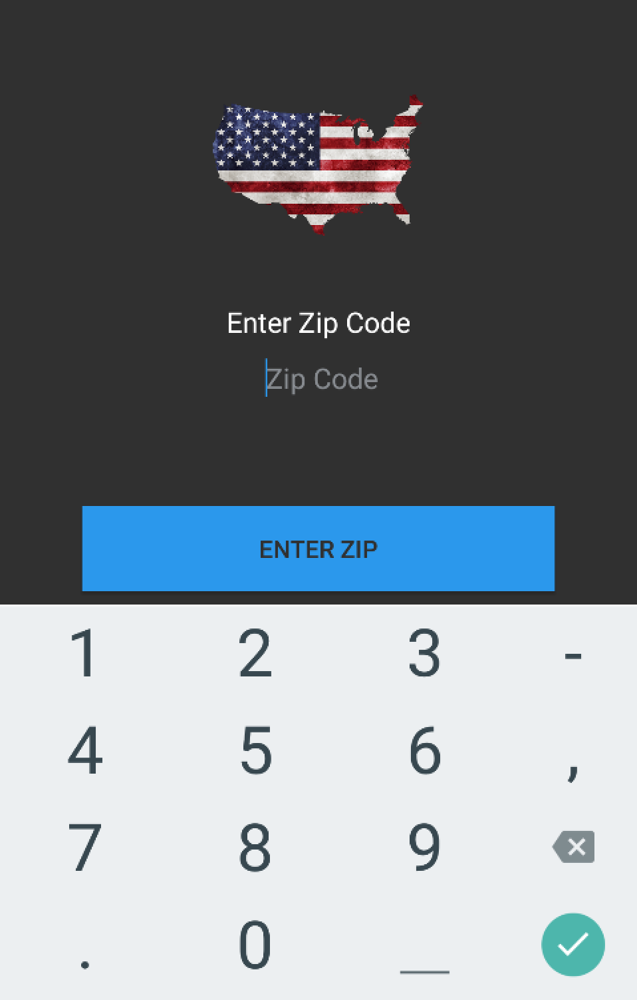
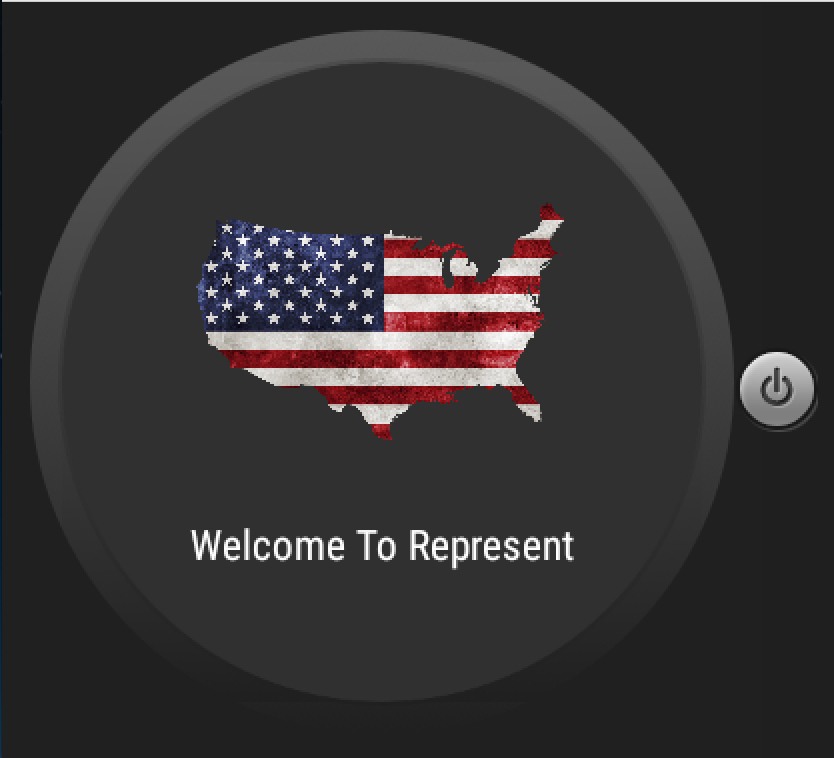
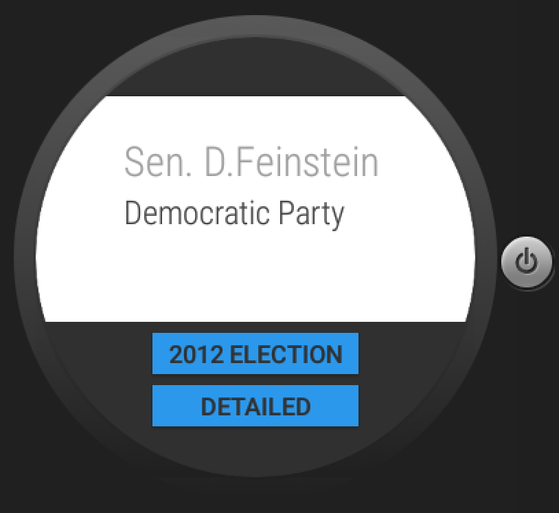
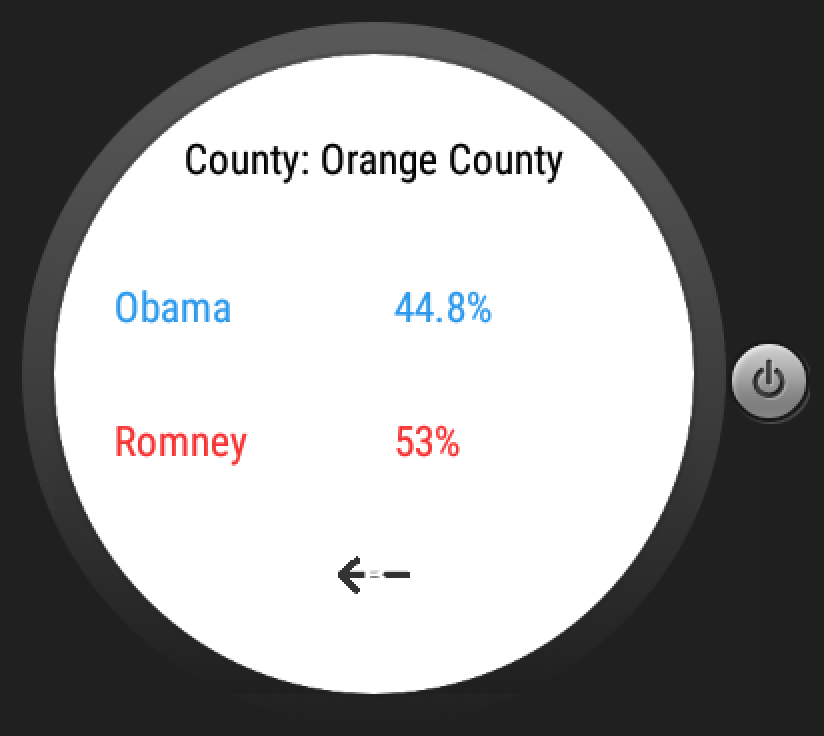

# PROG 02: Represent!

Represents helps Americans find and learn more about their congressional representatives.  Either provide your zip code, or use your current location, and we'll locate all your senators and representatives.  We'll give you several ways to contact them, their latest tweet, and a detailed view for each person including committees they serve on and bills they have sponsored.  Furthermore, the watch component provides a clean interface for scrolling through your representatives and getting the 2012 elections data from your local district!

## Authors

Daniel Dobalian ([ddobalian@berkeley.edu](mailto:ddobalian@berkeley.edu))

## Demo Video

See [Represent Walk Through] (https://link_to_your_video)

## Screenshots

Phone Screenshots 

Watch Screenshots

## Acknowledgments

* [Fabric](fabric.io) for a great twitter interface.
* [Picasso](http://square.github.io/picasso/) for a simple image http API.
* [Sunlight](sunlightfoundation.com) for congressional data.
* [Image API] (https://github.com/unitedstates/images) for all the images. 
* [Google] (google.com) for all the great geocoding and location API's.
* [Getting Tweets] (http://stackoverflow.com/questions/30518639/get-list-of-tweets-in-user-time-line-using-fabric-android) 
* [Asynch Queries] (http://www.compiletimeerror.com/2013/01/why-and-how-to-use-asynctask.html)
* [Android ListView Guide] (http://www.vogella.com/tutorials/AndroidListView/article.html)
* [Android Wear Examples] (https://github.com/livefront/android-wear-demo)
* [Changing text color in Android] (http://stackoverflow.com/questions/4602902/how-to-set-the-text-color-of-textview-in-code)
* [Button Animation] (http://developer.android.com/intl/es/reference/android/view/animation/AlphaAnimation.html)
* [Messaging API Guide] (https://www.binpress.com/tutorial/a-guide-to-the-android-wear-message-api/152) and also to skeleton code of Catnip provided by the CS 160 Staff.
* [Design motivation] (robinhood.com)

